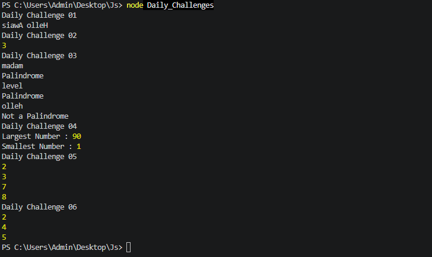

# 🚀 JavaScript Week 01 Practice

Welcome to my **JavaScript Week 01 Practice Repository**.

This repository contains my JavaScript practice programs and coding challenges completed during my learning journey.

---

## 📂 Project Structure

```
JS
│
├── outputs
│   ├── challenges.png
│   └── week1-output.png
│
├── Daily_Challenges.js
├── weeek1.js
├── Week01_word_prob.js
└── README.md
```

---

## 📚 Files

### 📄 Daily_Challenges.js
Contains solutions to daily JavaScript coding challenges.

### 📄 weeek1.js
Contains JavaScript concepts and practice programs from Week 1.

### 📄 Week01_word_prob.js
Contains JavaScript word problems and their solutions.

---

## 💡 Topics Covered

- Variables (`var`, `let`, `const`)
- Data Types
- Operators
- Conditional Statements
- Loops
- Functions
- Arrays
- Objects
- Strings
- Problem Solving

---

## 📸 Output Screenshots

### Daily Challenges Output



---

### Week 1 Output


---

## 🛠️ Technologies Used

- JavaScript (ES6)
- Visual Studio Code
- Git
- GitHub

---

## 👨‍💻 Author

**Awais Ijaz**

🎓 Software Engineering Student  
🏫 COMSATS University Islamabad  

💻 Learning JavaScript & MERN Stack Development

---

## ⭐ Repository Purpose

This repository is created to:

- Practice JavaScript fundamentals
- Improve problem-solving skills
- Track learning progress
- Build a professional GitHub portfolio

---

### Thank you for visiting this repository! ⭐