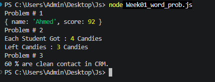

# JavaScript Practice Repository

This repository contains my JavaScript practice tasks, coding challenges, and weekly assignments completed during my learning journey.

## 📂 Files Included

- Daily_Challenges.js
- weeek1.js
- Week01_word_prob.js

## 🚀 Topics Covered

- Variables
- Data Types
- Operators
- Conditional Statements
- Loops
- Functions
- Arrays
- Objects
- String Methods
- Problem Solving

## 📸 Output Screenshots

### Challenge 

---

### Week 1 Output

---

## 👨‍💻 Author

**Awais Ijaz**

Software Engineering Student

COMSATS University Islamabad

Learning JavaScript | MERN Stack Developer
